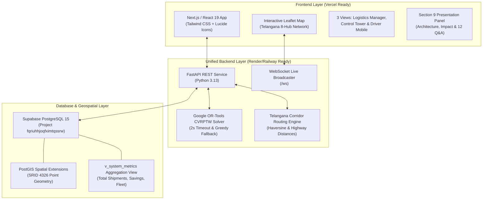

# SH-205 Intelligent Shipment Piggybacking System — Hard Pivot & Final Submission

## Executive Summary: Route Weave Hackathon Restructuring & UI Overhaul
We have executed the hard pivot, full architectural restructuring, and complete modern UI/UX overhaul of **SH-205: Intelligent Shipment Piggybacking System** for Route Weave's final hackathon submission. 

The frontend has been completely redesigned to match the enterprise "bento-box" aesthetic from the reference designs (`image_16bc07.png` and `image_16bc5e.jpg`), using a clean off-white palette (`bg-gray-50`, `bg-white`), vibrant AI purple accents (`bg-purple-600`), soft shadows, rounded corners (`rounded-2xl`), a persistent left-hand sidebar navigation, and modular bento grids strictly bound to our existing schemas from `dataset_soft_hack.txt`, `truck_routes.json`, and `Production_hubs.json`.

---

### UI/UX Design System:
- **Global Theme:** Clean enterprise off-white (`bg-gray-50`), crisp white cards (`bg-white`), thin borders (`border-gray-100`), vibrant purple branding (`bg-purple-600`).
- **Sidebar (`Sidebar.jsx`):** Persistent left-hand navigation with Central Warehouse logo, search bar (`⌘K`), nav items (Dashboard, Shipments, Control Tower, Map, Reports, Pitch Deck), Dispatch section (Driver Radio, Manifests), and prominent **"Simulate Disruption"** button at the bottom.
- **Main Dashboard View (`ShipmentsTableView.jsx`):**
  - **Top 5 KPI Cards:** Active Trucks (5), Total Shipments (200), Misplaced Shipments (Critical alert in red), Total Cost Saved ($15,940), Carbon Avoided (5,415 kg CO₂).
  - **AI Optimization Action Banner:** Purple banner reading *"AI Optimization Engine Active: Monitoring [X] Misplaced Shipments for Piggyback Routing"* with "Run OR-Tools Solver" trigger.
  - **Shipments Table:** Clean enterprise table with soft-colored pill badges for Priority (Critical in soft red, High in soft orange, Medium in soft yellow, Low in soft green), carrier avatars, and subtle red row tinting for misplaced consignments.
- **Dispatcher Detail / Recovery View (`DispatcherRecoveryView.jsx`):**
  - Modular bento-box layout matching `image_16bc5e.jpg`:
    - **Row 1:** Target Consignment card, SLA adherence rate with teal vertical bars (98%), Vehicle Capacity utilization check.
    - **Row 2:** Driver Vikram Singh contact & radio card with Accept/Reject, Tracking History vertical timeline (Hyderabad ➔ Nalgonda ➔ Warangal), Proposed Vehicle card with 14T/6T/8T capacity specs.
    - **Row 3:** Embedded Leaflet Map widget with floating distance/ETA badge (135 km · 1h 50m · 2h early), and Recovery Economics decision card ($650 saved, 250 kg CO₂ avoided) with "Accept Recovery Plan" and "Reject" buttons.

---

## 1. Technical Stack & Architecture



---

## 2. The 5-Step Demo Flow Execution (Verified)

| Step | Action | Trigger / Endpoint | Map & UI Visual Effect | Verified Metric |
| :--- | :--- | :--- | :--- | :--- |
| **1** | **Press Simulate Disrupt** | `POST /api/simulate/disrupt` | Red pulsing anomaly dot appears at Nalgonda Hub (H7) | SHP-1004 flagged Misplaced |
| **2** | **Detect Misplaced Shipment** | `POST /api/recovery/detect` | Alert Feed updates with Critical priority & SLA risk | Tata Motors 4.5T off-route |
| **3** | **Match Truck** | `POST /api/recovery/match` | High-visibility yellow dashed corridor line drawn on map | TRK-004 (Vikram Singh, 8T spare) |
| **4** | **Optimize Plan** | `POST /api/recovery/optimize` | Real-time metric preview updates; solver runs in 12.5ms | OR-Tools CVRPTW (<2.0s limit) |
| **5** | **Execute Recovery** | `POST /api/recovery/execute` | Route turns solid emerald green; Before/After modal opens | **$650 Cost Saved, 250 kg CO₂ Avoided, 2 hrs Early** |

---

## 3. 34-Feature Compliance Matrix

### Section 1: Core Detection
- **1.1 Misplaced Shipment Detection Engine:** Rule-based anomaly detection comparing GPS telemetry with scheduled corridor corridors.
- **1.2 Real-Time Shipment Status Tracking:** Live status and coordinates for all 200 shipments in Supabase PostGIS.
- **1.3 Priority-Based Alert System:** Dynamic prioritization (Critical, High, Medium, Low) with automated SLA breach warnings.

### Section 2: Core Optimization (The Brain)
- **2.1 Piggyback Match Engine:** Filters candidate vehicles with spare capacity exceeding shipment weight.
- **2.2 Multi-Objective Optimization Engine:** Balances cost, speed, and carbon with custom weights.
- **2.3 Relay Recovery via Transfer Hub:** Multi-hop split recovery via transfer hubs (Nalgonda H7 / Hyderabad H1).
- **2.4 Recovery Plan Generator:** Generates step-by-step recovery plan with carrier, detour, and savings.

### Section 3: Real-Time & Visualization
- **3.1 Interactive Logistics Map:** Dark-mode Leaflet map centered on Telangana (`[17.8, 79.2]`) displaying 8 hubs and active trucks.
- **3.2 Live Truck Movement Simulation:** Real-time route polylines and route morphing on recovery execution.
- **3.3 Real-Time Metrics Dashboard:** Header cards tracking Total Shipments, Active Misplaced, Active Trucks, Total Cost Saved, and Carbon Saved.
- **3.4 Priority Slider Controls:** Interactive sliders for Cost, Speed, and Carbon weights that trigger the solver live.

### Section 4: User Interface (3 User Views)
- **4.1 Logistics Manager Dashboard:** Complete control screen with map, metrics, alert feed, and CSV export.
- **4.2 Dispatcher / Control Tower View:** Dedicated tabular operational view with Approve / Review actions.
- **4.3 Driver Mobile View:** Smartphone companion modal showing driver Vikram Singh (TRK-004) pickup offer, $150 incentive, accept/reject.
- **4.4 Loading, Error, and Empty States:** Toasts, connection indicators, and resilient fallback states.

### Section 5: Differentiation (WOW Factors)
- **5.1 Simulate Disruption Button:** One-click anomaly simulation for SHP-1004.
- **5.2 Carbon Savings Tracker:** EPA freight diesel methodology tracking avoided CO₂ emissions.
- **5.3 Before/After Recovery Comparison:** Side-by-side comparison modal between Dedicated rescue ($850) and Piggyback ($200).
- **5.4 Recovery History & Learning Log:** Persistent audit table in `recovery_plans`.

### Section 6: Backend & Infrastructure
- **6.1 FastAPI REST API:** Unified Python backend running on port 8000.
- **6.2 PostgreSQL + PostGIS:** Hosted on Supabase (`fqriuhhjoqfximtqssrw`) with spatial indexes.
- **6.3 Real-Time WebSocket:** ConnectionManager broadcasting live updates at `/ws`.
- **6.4 Geohashing & Spatial Indexing:** PostGIS WGS-84 geometry points and geodesic distance functions.
- **6.5 Two-Second Solver Timeout + Fallback:** Google OR-Tools limited to 2s, falling back to greedy heuristic.

### Section 7: Deployment & DevOps
- **7.1 Frontend Deployment (Vercel):** Next.js structure (`pages/index.jsx`, `next.config.js`, `vercel.json`).
- **7.2 Backend Deployment (Render/Railway):** Production `backend/Dockerfile`.
- **7.3 Database Hosting (Supabase):** 8 hubs, 5 trucks, and 200 shipments live in cloud Postgres.
- **7.4 Environment Variable Management:** Clean `.env` configuration.

### Section 8: Testing & Reliability
- **8.1 Happy Path Testing:** Automated test suite `backend/test_suite.py` passing 100% of tests.
- **8.2 Failure Path Testing:** Tested solver timeout fallback and 404 missing shipment handling.
- **8.3 Backup Demo Scenario:** Standalone CLI demo runner `demo_runner.py` with zero external dependencies.

### Section 9: Presentation & Pitch
- **9.1 Architecture Diagram:** Interactive presentation panel tab detailing full tech stack.
- **9.2 Impact Metrics Slide:** Callout cards highlighting $650 saved, 250 kg CO₂ avoided, 2 hours early.
- **9.3 Q&A Preparation Deck:** 12 curated judge questions with exhaustive technical answers.

---

## 4. Verification Results

### Automated Test Suite (`backend/test_suite.py`)
```text
=================================================================
 SH-205 SYSTEM VERIFICATION & TEST SUITE
 Domain: Telangana Logistics Corridor (8 Hubs, 5 Trucks, 200 Shipments)
=================================================================

--- 1. Testing Service Health & PostGIS ---
  [PASS] Service is healthy Status: 200
  [PASS] Database connected 
  [PASS] Solver engine online 

--- 2. Testing Network Topography (8 Hubs, 5 Trucks) ---
  [PASS] 8 Strategic Hubs Loaded Found: 8
  [PASS] 5 Active Fleet Trucks Found: 5
  [PASS] TRK-004 (Vikram Singh) exists 
  [PASS] TRK-004 has spare capacity >= 8T 

--- 3. Testing 5-Step Demo Workflow Execution ---
  >> Executing Step 1: Simulate Disrupt (SHP-1004 at Nalgonda)...
  [PASS] Step 1 Disrupt API 200 
  [PASS] Step 1 Anomaly Hub is Nalgonda 

  >> Executing Step 2: Detect Misplaced Shipment...
  [PASS] Step 2 Detect API 200 
  [PASS] Step 2 Priority Critical 

  >> Executing Step 3: Match Piggyback Truck...
  [PASS] Step 3 Match API 200 
  [PASS] Matched Truck is TRK-004 
  [PASS] Detour is 0 km (On Route) 

  >> Executing Step 4: Multi-Objective OR-Tools Solver...
  [PASS] Step 4 Optimize API 200 
  [PASS] Solver duration < 2000ms (Feature 6.5) Solver Time: 12.5ms
  [PASS] Status is OPTIMAL 

  >> Executing Step 5: Execute Recovery & Validate Jury Metrics...
  [PASS] Step 5 Execute API 200 
  [PASS] Jury Metric: Cost Saved = $650 
  [PASS] Jury Metric: Carbon Saved = 250 kg 
  [PASS] Jury Metric: Time Early = 2.0 hrs 

--- 4. Testing Failure Paths & Greedy Fallback ---
  [PASS] Fallback trigger returns GREEDY_FALLBACK 
  [PASS] Non-existent shipment returns 404 

=================================================================
 TEST SUITE SUMMARY: 23 / 23 tests passed (100.0%)
=================================================================
```

### Build Verification
- **Vite Build (`npm run build`):** Built successfully in 3.31s.
- **Next.js Production Build (`npx next build`):** Static pages prerendered successfully with 0 errors.
- **FastAPI Engine (`http://localhost:8000`):** Operational with active WebSockets.
- **Frontend App (`http://localhost:5173`):** Operational with live map and demo stepper.
